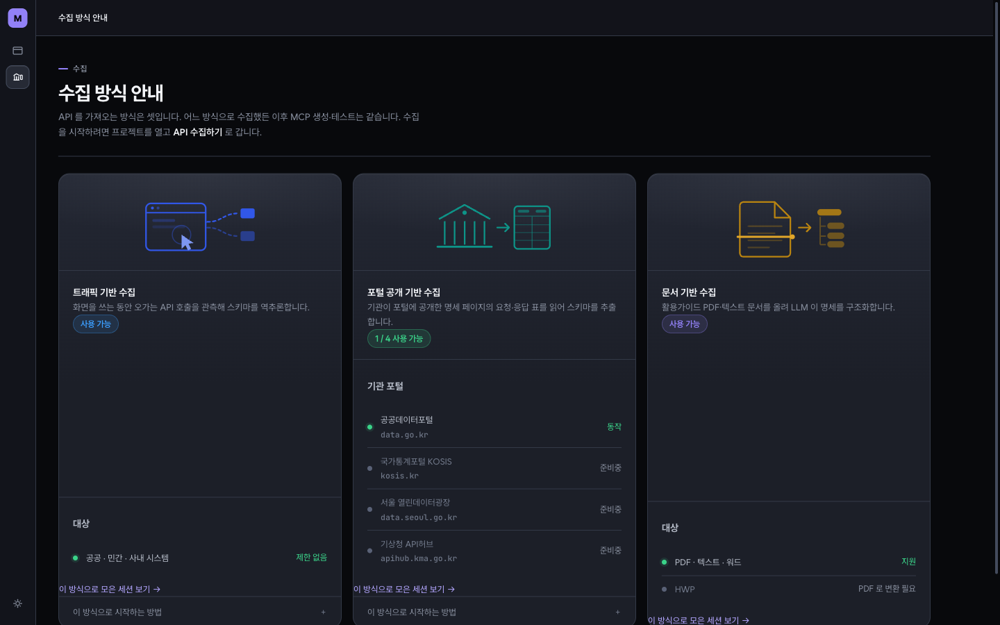
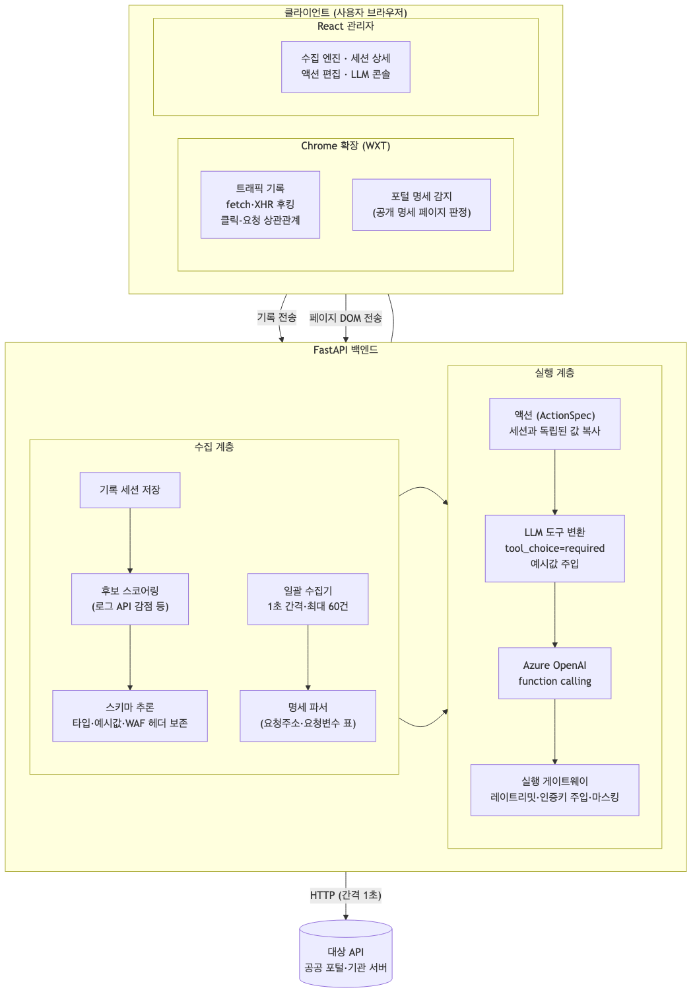
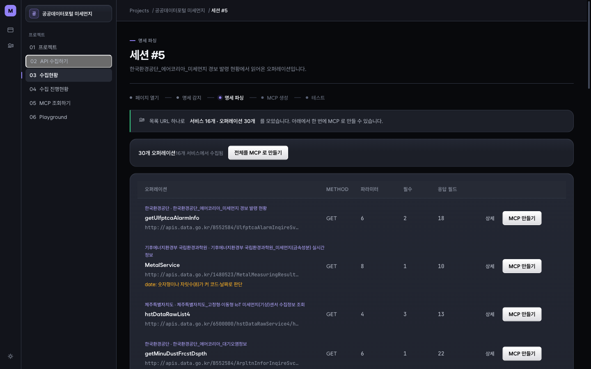
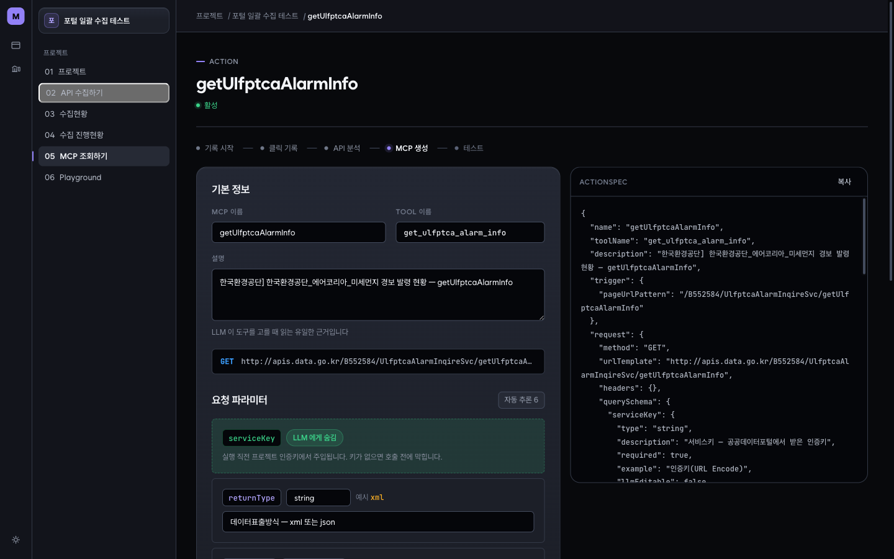
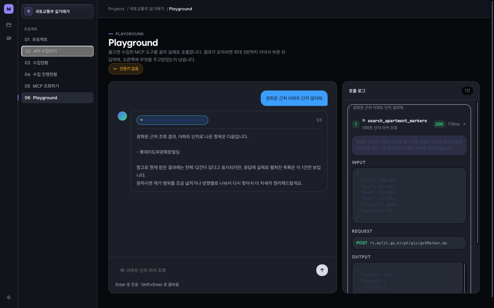

# 표지
- 프로젝트명: "레거시 환경"을 위한 AI 프로토콜 변압기(AI Protocol Transformer)
- 팀명: [제출 전 기재: 팀명]
- 팀대표명: 김원태
- 팀대표 소속: [제출 전 기재: 소속]
- 팀 구성 인원: 4명
- 제출일: 2026. 07. 31

## 1.1 프로젝트 명

"레거시 환경"을 위한 AI 프로토콜 변압기(AI Protocol Transformer) — 기존 웹 서비스의 통신 규격을 AI가 이해할 수 있는 표준 규격으로 자동 전환해 주는 미들웨어 플랫폼 (구현제안서와 동일)

## 1.2 프로젝트 한줄 요약 설명

기존 웹 서비스가 실제로 주고받는 API 호출과 포털에 공개된 명세를 자동으로 수집·분석해 LLM이 안전하게 호출할 수 있는 표준 액션(Tool)으로 변환하는 미들웨어 플랫폼이다.

## 1.3 기술 목적

정부 기관과 기업의 레거시 웹 서비스를 AI 에이전트 생태계에 연결하는 일은 지금까지 사람의 몫이었다. 각 시스템의 API를 일일이 분석해 명세를 작성하고 연동 코드를 새로 개발하는 SI 방식이다. 문서화되지 않았거나 문서와 실제가 다른 API가 많아 이 비용은 시스템 수에 비례해 늘어난다. 본 기술은 110V 전용 구형 가전을 220V 전력망에 꽂게 해 주는 변압기와 같다. 기존 소스코드를 한 줄도 수정하지 않고 레거시 시스템을 AI 에이전트가 호출 가능한 형태로 전환하는 것을 목적으로 한다.

기존 기술의 한계는 다음과 같다.

- **수동 명세 작성 의존**: mcp-use 등 MCP 서버 제작 도구는 뛰어난 건축 도구이지만 개발자가 대상 시스템의 API 명세를 정확히 알고 직접 코드를 작성해야 한다.
- **문서와 실제의 불일치**: 공개 문서가 있어도 실제 호출에 필요한 헤더·파라미터와 다른 경우가 많아 문서만 읽어서는 동작하는 연동을 만들 수 없다.
- **명세만 게시된 API**: 공공데이터포털처럼 API를 실행하지 않고 명세 표만 게시하는 포털은 트래픽 관측으로도, 문서 변환만으로도 온전히 다루기 어렵다.

본 기술은 화면이 실제로 부른 호출의 관측과 공개 명세의 파싱이라는 **이중 역분석**으로 이 한계를 넘어 검증된 실제 데이터에 근거한 액션을 자동 생성한다.

## 1.4 기술 동향

- **(해외) MCP의 사실상 표준화**: Anthropic이 2024년 말 공개한 MCP(Model Context Protocol)는 2025년 12월 리눅스 재단 산하 Agentic AI Foundation으로 이관되었다. OpenAI·Google·Microsoft·Salesforce는 공식 지원을 발표했다. 2026년 상반기 기준 공식 레지스트리 등록 서버가 6,400개를 넘고 SDK 월간 다운로드가 9,700만 회에 이르는 등(업계 집계) AI-도구 연동의 표준 계층으로 자리잡았다.
- **(해외) 에이전트형 AI의 확산**: LLM function calling은 주요 모델의 기본 기능이 되었다. browser-use·Playwright 기반 브라우저 에이전트처럼 "화면을 조작하는 AI"도 활발히 연구된다. 다만 이들은 매 실행마다 화면을 다시 탐색하므로 반복 호출에는 API 수준의 안정된 도구 정의가 여전히 필요하다.
- **(국내) 공공 AX와 오픈API 생태계**: 정부의 행정 AI 전환(AX) 기조 아래 공공데이터포털 등에 방대한 오픈API 명세가 공개되어 있으나 대부분 사람이 읽는 HTML 표 형태여서 AI 에이전트가 직접 소비할 수 없다. 공개된 명세를 기계가 쓸 수 있는 도구로 바꾸는 계층이 비어 있다.

## 1.5 유사 기술 비교 및 차별점

| 구분 | mcp-use (MCP 서버 프레임워크) | Playwright·browser-use (브라우저 에이전트) | 본 기술 |
|---|---|---|---|
| 명세 확보 | 개발자가 API 명세를 알고 직접 작성 | 명세 없이 매 실행 시 화면 탐색 | 실호출 관측 + 공개 명세 파싱으로 자동 확보 |
| 자동화 수준 | 서버 골격 코드 자동화 | 조작 자동화 (도구화는 별도) | 수집→스키마 추론→액션 생성→실행까지 파이프라인 자동화 |
| 실행 신뢰장치 | 개발자 구현에 위임 | 없음 (화면 의존) | 호출 간격 제한·인증키 은닉·민감정보 마스킹·실행 전 확인 내장 |

차별점은 세 가지다. 첫째, 수집 경로가 셋이다. 화면이 부른 호출의 관측(트래픽 기반), 포털 공개 명세의 파싱(포털 기반), 활용가이드 문서 변환(문서 기반)이다. 어느 경로로 모았든 이후 액션 생성·실행은 같은 파이프라인을 쓴다. 둘째, 스키마를 실제 데이터에서 추론한다. 파라미터 타입·예시값은 물론 대상 서버(WAF)가 요구하는 헤더까지 실측으로 보존해 "문서상으로는 맞는데 실제로는 400이 나는" 문제를 차단한다. 셋째, 실행 계층에 신뢰장치를 내장한다. LLM에게 인증키를 노출하지 않고 공공 서버 호출 간격을 강제하며, 민감정보를 세 지점에서 마스킹한다.

## 1.6 구현제안서 대비 변경 사항

예선 이후 실제 공공 서비스를 대상으로 실증하는 과정에서 확인된 사실에 근거해 다음을 변경했다. 참가 트랙(일반 트랙)과 기술 목적은 변경 없다.

| 구분 | 구현제안서 내용 | 변경 후 내용 | 변경 사유 |
|---|---|---|---|
| 수집 방식 | VLM 기반 시각 인지 에이전트의 자율 탐색 | Chrome 확장 기반 사용자 주도 기록 + 클릭-요청 상관관계 스코어링 | 실사용 흐름을 그대로 관측하는 편이 명세 정확도가 높고 VLM 추론 비용·비결정성을 제거 |
| 수집 범위 | 트래픽 역추론 단일 경로 | 트래픽 / 포털 공개 명세 / 문서 3경로 (전부 동작) | API를 실행하지 않고 명세만 게시하는 공공 포털 대응이 필요함을 확인 |
| MCP 바인딩 | mcp-use 규격 MCP 서버 자동 배포 | OpenAI function calling 도구 변환을 선행 구현, MCP 엔드포인트는 2차 기간 계획 | 도구 정의·실행 계층을 먼저 실증한 뒤 표준 바인딩을 얹는 순서가 위험이 낮음 |
| 기술 스택 | PostgreSQL·Redis·Celery·LangChain | SQLite·SQLModel·FastAPI 직접 호출 | 프로토타입 단계의 반복 속도 우선. 분산 구성요소는 규모 확장 시점에 도입 |
| 배포 방식 | On-Premise 설치 패키지(Helm) | Azure Container Apps 클라우드 배포 (master 머지 시 자동 배포) | 심사·시연 접근성 우선. On-Premise 패키지는 사업화 단계 계획으로 이동 |

## 2.1 핵심 기술

**문제**: 레거시 웹 서비스의 API는 비정형적이다. 문서가 없거나 실제와 다르고 WAF가 특정 헤더를 요구하며, 명세만 게시된 API는 호출 자체를 관측할 수 없다. 이런 API를 LLM의 도구로 바꾸려면 지금까지는 사람이 시스템마다 분석·개발을 반복해야 했다.

**핵심 아이디어 — 이중 역분석**: 화면이 실제로 부른 호출을 관측하는 경로와 포털에 공개된 명세 표를 파싱하는 경로를 하나의 파이프라인으로 합류시킨다. "실제로 동작한 데이터"에서 스키마를 추론하므로 문서 불일치 문제가 원천적으로 없다. 실행이 불가능한 명세형 API도 포털 파싱으로 흡수한다.

**핵심 기술 구성요소** (6개):

- **수집 3경로**: ① Chrome 확장이 Main World에서 fetch·XHR을 후킹해 클릭과 API 요청의 상관관계를 기록 (트래픽 기반) ② 공개 명세 페이지를 감지해 요청주소·요청변수 표를 파싱 (포털 단건) ③ 검색 결과 URL 하나로 상세페이지들을 순회해 상세기능 전체를 수집 (포털 일괄)
- **후보 스코어링**: 기록된 요청들을 점수화해 "화면의 데이터를 실제로 나른 API"를 상위에 올린다. 변경성 메서드·클릭 직후 발생 등에 가점, 로그성 API에 감점을 주어 잡음을 최하위로 내린다.
- **스키마 추론**: 파라미터의 타입·예시값을 실측값에서 추론하고 대상 서버가 요구하는 헤더(User-Agent·Referer·X-Requested-With 등)를 선별 보존한다.
- **액션(ActionSpec)**: 추론 결과를 기록 세션과 독립된 값 복사본으로 저장한다. 원본 기록을 지워도 액션은 그대로 동작한다.
- **실행 게이트웨이**: 모든 대상 API 호출이 통과하는 단일 관문. 호출 간격 제한(1초), 실행 직전 인증키 주입, 민감정보 마스킹, 응답 구조화(원문 미저장)를 담당한다.
- **LLM 도구 변환**: 액션을 function calling 도구 정의로 자동 변환한다. 파라미터 예시값을 설명에 실어 모델이 값을 지어내지 않게 한다.

**기존 접근과의 차이**: 명세를 아는 사람이 서버를 "작성"하는 방식(mcp-use 등)이 아니라, 시스템이 명세를 "발견"해 도구를 만든다. 개발자의 사전 지식 없이도 화면을 한 번 조작하거나 포털 URL 하나를 등록하는 것으로 충분하다.

## 2.2 기술 구현 방안

- **활용 AI 모델**: Azure OpenAI의 function calling 지원 배포를 사용한다. 도구 정의는 액션에서 자동 생성된다. 모델 교체는 배포 설정 변경만으로 가능하다.
- **데이터 구성 및 파이프라인**: 확장이 보낸 기록(클릭 이벤트·네트워크 요청)은 세션으로 저장된다. 스코어링을 거쳐 요청이 선택된다. 선택된 요청은 스키마 추론기를 통과해 ActionSpec이 된다. 포털 경로는 명세 파서가 같은 ActionSpec 형태로 합류한다. 민감 키(password·token·apiKey 등 8종)는 URL 쿼리·요청 본문·응답 샘플 세 지점에서 마스킹된다. 응답 본문은 원문 대신 구조와 샘플 1건만 남긴다.
- **학습·튜닝 방식**: 모델 학습 대신 **도구 정의 엔지니어링**으로 정확도를 확보한다. 실측으로 확인한 두 가지가 핵심이다. ① 한국어 시스템 메시지와 `tool_choice=required`를 함께 보내야 모델이 도구를 확실히 호출한다(하나만으로는 모델이 도구를 부르지 않고 되묻는 현상을 실측). ② 파라미터 `example`을 도구 설명에 포함하면 모델이 실측 예시값 근처의 합리적 값을 채운다.
- **추론·배포 환경**: FastAPI 백엔드(:8000) + React 관리자(:5173) + Chrome 확장(WXT)으로 구성된다. Azure Container Apps에 배포되어 있으며 master 브랜치 머지 시 자동 배포된다.

## 3.1.1 개발 목표

전 구간 파이프라인(수집 → 스키마 추론 → 액션 → 실행)을 구축한다. 레거시 웹 서비스의 API를 실사용 관측과 공개 명세 파싱으로 자동 수집하고 LLM이 안전하게 호출할 수 있는 표준 액션으로 변환하는 파이프라인이다. 1차 기간의 목표는 이를 실제 공공 서비스 대상으로 끝까지 실증하는 것이다.

## 3.1.2 주요기능 명세

- ① **트래픽 기반 API 기록** — Chrome 확장이 화면 조작 중 발생하는 API 호출을 클릭과 연결해 기록
- ② **포털 공개 명세 수집** — 명세 페이지 감지·파싱(단건) 및 검색 결과 URL 하나로 일괄 수집
- ③ **API 스키마 자동 추론·액션 변환** — 파라미터 타입·예시값·필수 헤더를 실측에서 추론해 액션 생성
- ④ **LLM 도구 실행 게이트웨이** — 자연어 질의 → 도구 선택 → 확인 → 실제 API 호출 → 결과 요약
- ⑤ **통합 관리자 콘솔** — 프로젝트·수집·MCP·Playground 를 6단계 흐름으로 관리하는 웹 화면

## 3.1.3 시스템 구성도

Chrome 확장(수집)·FastAPI 백엔드(분석·변환·실행)·React 관리자(운영 화면)의 3계층 구조다. 트래픽 기록과 포털 명세 파싱이라는 서로 다른 수집 경로는 액션(ActionSpec)에서 합류한다. 이후의 LLM 도구 변환과 실행 게이트웨이는 수집 방식과 무관하게 공유된다.

## 3.1.4 사전 구현 성과

- **전 구간 파이프라인 완주**: 실제 공공 서비스(국토교통부 실거래가 지도)에서 클릭 기록 → 후보 스코어링 → 액션 생성 → 자연어 질의 → 실 API 호출 → 결과 요약까지 사람의 코드 작성 없이 동작함을 실증
- **자동 테스트 158개 통과**: 백엔드 136개 + 확장 22개, 타입체크 2종 (2026-07-30 실측)
- **포털 일괄 수집 실증**: 검색 URL 1건 입력 → **92초** 만에 상세페이지 34개 순회, 서비스 16개에서 오퍼레이션 30개 수집 (2026-07-30 실측)
- **LLM 실행 실증**: 자연어 질의에서 도구 선택·파라미터 6개 자동 완성, 대상 API **HTTP 200 · 227ms** 응답과 한국어 요약 (2026-07-30 실측)
- **클라우드 배포**: Azure Container Apps 배포 및 master 머지 시 자동 배포 파이프라인 구축

## 3.1.5 향후 계획 및 한계점 보완

- **MCP 엔드포인트 표준화**: 현재 function calling 도구로 실증된 액션 계층에 mcp-use 규격의 MCP 서버 바인딩을 얹어 외부 AI 에이전트가 표준 프로토콜로 접속하게 한다 (구현제안서의 핵심 목표 회수)
- **문서 기반 수집 확장**: 셋째 경로는 구현·동작한다(PDF·텍스트). 스캔 이미지 문서(HWP 포함)의 광학 문자 인식을 남긴다
- **HITL 인증 브릿지**: 로그인·MFA 등 보안 장벽에서 사람에게 개입을 요청하는 협업 인터페이스 (구현제안서 제안 항목)
- **API 토폴로지 그래프**: 수집된 API 간 호출 순서·데이터 의존성 추론
- **운영 기능 보강**: 프로젝트 CRUD·로그인·액션 버전 관리 등 프로토타입에서 생략한 운영 기능

## 3.2.1 기능 명칭

① 트래픽 기반 API 기록, ② 포털 공개 명세 수집(단건·일괄), ③ API 스키마 자동 추론·액션 변환, ④ LLM 도구 실행 게이트웨이, ⑤ 통합 관리자 콘솔

## 3.2.2 기능 개요 및 주요 기능

### ① 트래픽 기반 API 기록
확장이 페이지의 Main World에서 fetch·XHR을 후킹해 사용자의 클릭과 그로 인해 발생한 API 요청을 상관관계로 묶어 기록한다. 기록 종료 시 서버로 전송되어 후보 스코어링을 거친다. 클릭 직후 발생·변경성 메서드 등에 가점, 로그성 API에 감점을 주어 "화면의 데이터를 실제로 나른 API"가 상위에 온다.

### ② 포털 공개 명세 수집
API를 실행하지 않고 명세만 게시하는 포털 대응 경로다. 사용자가 연 명세 페이지를 확장이 감지해 요청주소·요청변수 표를 파싱한다(단건). 검색 결과 URL 하나를 등록하면 서버가 상세페이지들을 순회해 각 서비스의 상세기능 전체를 수집한다(일괄). 공공 서버를 배려해 요청 간 1초 간격과 회당 상한을 강제한다.

### ③ API 스키마 자동 추론·액션 변환
기록된 요청에서 파라미터의 타입·예시값을 추론하고 대상 서버(WAF)가 요구하는 헤더를 선별 보존해 ActionSpec을 만든다. 액션은 기록 세션과 독립된 값 복사본이라 원본 기록을 지워도 동작한다. 포털 인증키(serviceKey)는 `llmEditable=false`로 표시되어 LLM에게 노출되지 않는다.

### ④ LLM 도구 실행 게이트웨이
액션을 function calling 도구 정의로 변환해 LLM에 제시하고 모델이 고른 도구와 인자를 사용자가 확인한 뒤 실행한다. 모든 호출은 단일 게이트웨이를 통과하며 호출 간격 제한·인증키 주입·민감정보 마스킹이 적용된다. 실행 결과는 한국어로 요약된다.

### ⑤ 통합 관리자 콘솔
프로젝트 → API 수집하기 → 수집현황 → 수집 진행현황 → MCP 조회하기 → Playground 의 계층 화면. 어느 단계에 있는지 6단계 사이드바로 표시하며 동작하는 것과 준비 중인 것을 화면에서 구분해 보여준다.

## 3.2.3 개발 진행 현황

**① 트래픽 기반 기록** — 전 구간 동작. 실측(리허설 기록): 지도 확대 클릭 1회당 API 요청 3건 안팎이 클릭과 연결되어 포착된다. 로그성 API(`accesLog.do`)는 감점되어 항상 최하위로 표시된다. 확장 vitest 22개 통과.

**② 포털 명세 수집** — 단건·일괄 모두 동작. 2026-07-30 실측: 키워드 "미세먼지" 검색 URL 1건 → **92초**에 상세페이지 34개 순회, 서비스 16개에서 오퍼레이션 30개(설정 상한 도달) 수집, 파라미터 4~8개·응답 필드 8~32개가 자동 추출되었다. 진행 상태는 화면에서 실시간 확인된다.

**②-1 문서 기반 수집(셋째 경로)** — 동작. 구현제안서 이후 추가한 경로다. 2026-07-30 실측: 활용가이드 PDF를 올리면 API 2개, 사내 API 명세서에서는 3개를 각각 10초 안에 추출했다. 엔드포인트가 없는 문서(보도자료)와 글자 층이 없는 스캔본에서는 **도구를 만들지 않고 그 이유를 화면에 밝힌다** — 없는 API를 지어내지 않는 쪽이 더 중요하다. 스캔 이미지의 광학 문자 인식이 남았다.

**③ 스키마 추론·액션 변환** — 동작. 실측 기록에서 파라미터 6개(경위도 4·연도·종류 코드)가 타입·실측 예시값과 함께 자동 완성된다. ActionSpec에는 보존 헤더와 `llmEditable`·마스킹 규칙 8종이 담긴다. 한계: 요청 본문이 JSON인 API의 bodySchema는 미지원(현재 대상은 모두 form-urlencoded).

**④ LLM 실행 게이트웨이** — 동작. 2026-07-30 실측: "광화문 근처 아파트 단지 알려줘" 질의에 `search_apartment_markers` 도구가 선택되고 파라미터 6개가 전부 자동으로 채워졌다. 실행 결과 **HTTP 200 · 227ms**로 실제 단지명(세종, 광화문스페이스본, 경희궁자이 등)이 담긴 한국어 요약이 반환되었다.

**⑤ 통합 관리자 콘솔** — 동작. 수집현황·세션 상세·MCP 편집·Playground 가 6단계 사이드바로 연결된다. admin 타입체크(`tsc -b`) 통과.

## 3.2.4 진척도

| 기능 | 진척도(제안) | 산정 근거 |
|---|---|---|
| ① 트래픽 기반 기록 | 90% | 전 구간 동작·테스트 통과. 기록 UX 다듬기 여지 |
| ② 포털 명세 수집 | 85% | data.go.kr 단건·일괄 동작. 타 포털 3곳(KOSIS 등) 파서 확장 남음 |
| ③ 스키마 추론·액션 변환 | 85% | 동작·테스트 통과. JSON bodySchema 미지원 |
| ④ LLM 실행 게이트웨이 | 90% | 신뢰장치 포함 동작. MCP 표준 바인딩은 별도 항목 |
| ⑤ 통합 관리자 콘솔 | 85% | 핵심 흐름 완성. 프로젝트 CRUD·로그인 생략 |
| **종합 (최종 목표 대비)** | **80%** | 1차 목표(전 구간 실증) 달성에 더해 문서 기반 수집까지 동작. MCP 엔드포인트·HITL이 2차 범위 |

## 3.3.1 정량적 우수성

본 기술 영역(레거시 API의 자동 도구화)은 공인 벤치마크가 없다. SOTA 수치 비교 대신 재현 가능한 자체 실측 지표를 제시한다 (전 항목 2026-07-30 실측, 근거 기록 보존).

| 지표 | 실측 결과 |
|---|---|
| 자동 테스트 | **158개 전부 통과** (백엔드 pytest 136 · 확장 vitest 22) + 타입체크 2종 |
| 포털 일괄 수집 처리량 | 검색 URL 1건 → **92초**에 서비스 16개·오퍼레이션 30개 (상세페이지 34개 순회, 요청 간 1초 준수 포함) |
| 스키마 자동 추출 | 오퍼레이션당 파라미터 4~8개·응답 필드 8~32개, 사람 개입 0회 |
| LLM 도구 실행 | 파라미터 6개 전항목 자동 완성, 대상 API **HTTP 200 · 227ms**, 실데이터 요약 반환 |
| 후보 선별 정확도 | 로그성 API를 감점 규칙으로 항상 최하위 배치 (반복 리허설에서 예외 없음) |

같은 작업을 사람이 하면 API 1건마다 명세 분석과 연동 코드 작성이 필요하다. 이를 감안하면 URL 1건 입력 → 92초 → 30개 오퍼레이션은 도구화 비용을 자릿수 단위로 낮추는 결과다.

## 3.3.2 혁신성·도전성

- **A2S(Agent-centric Software) 지향**: "사람을 위한 UI" 뒤에 숨은 기능을 "AI 에이전트를 위한 도구"로 재편하는 접근이다. 최신 AI 에이전트·MCP 트렌드와 정확히 정합한다.
- **비침투적 연동**: 대상 시스템의 소스코드를 한 줄도 수정하지 않고 관측과 공개 명세만으로 연동을 만들어 낸다.
- **자가 도구화(Self-toolmaking)의 실증**: AI가 쓸 도구를 AI 파이프라인이 만들어 내는 메타 자동화를 실제 공공 서비스를 대상으로 끝까지 동작시켰다.

## 3.3.3 대표 성과·실적

- 실제 공공 서비스 2종(국토교통부 실거래가, 공공데이터포털) 대상 전 구간 실증 완료
- Azure Container Apps 공개 배포 및 자동 배포 파이프라인 운영
- 자동 테스트 158개·타입체크 2종의 검증 체계 구축
- 논문·특허는 미출원 (자율 API 토폴로지 추론 등 핵심 아이디어의 출원 여부를 2차 기간에 검토)

## 3.3.4 신뢰성·안전장치

- **민감정보 마스킹 3지점**: 민감 키 8종(password·token·apiKey·sessionId·ssn·jumin·cardNumber·cvv)을 URL 쿼리·요청 본문·응답 샘플 모두에서 마스킹
- **인증키 LLM 비노출**: 포털 인증키는 `llmEditable=false`로 LLM에게 감추고 실행 직전 서버가 주입. 키가 없으면 호출 전에 차단
- **대상 서버 보호**: 모든 호출 간격 최소 1초, 일괄 수집 회당 상한, 스케줄러·자동 재수집 없음, robots.txt 확인을 거친 설계
- **데이터 최소 보존**: 응답 본문 원문을 저장하지 않고 구조와 샘플 1건만 보존
- **환각 억제**: `tool_choice=required`와 파라미터 예시값 주입으로 모델이 도구·인자를 지어내는 것을 방지하고 결과 요약은 실제 API 응답 데이터에 근거
- **실행 전 사용자 확인(HITL)**: 질의 → 선택된 도구·인자 표시 → 사용자 확인 → 실행의 2단계 구조로 LLM이 임의로 외부 호출을 실행하지 않음

## 4.1 연구 지원 활용 항목

| 구분 | 활용자원 | 활용 규모 |
|---|---|---|
| 생성형 AI API (해외) | Azure OpenAI (function calling 지원 배포) | [제출 전 기재: Azure 토큰 사용량] |

GPU 자원은 사용하지 않았다 (본 기술은 모델 학습 없이 API 활용으로 구현).

## 4.2 주요 활용 성과

지원받은 Azure OpenAI API로 파이프라인의 지능 계층 전체를 구현했다. 자연어 질의에서 도구를 선택하는 일, 파라미터 값 추론(실측 예시값 기반), 실행 결과의 한국어 요약까지 모두 function calling으로 동작한다. 활용 과정에서 한국어 시스템 메시지와 `tool_choice=required`를 병용해야 모델이 도구를 확실히 호출한다는 점, 파라미터 예시값을 도구 설명에 실어야 모델이 값을 지어내지 않는다는 점을 실측으로 확정해 도구 정의 엔지니어링 노하우로 축적했다.

## 5.1 연계 기업 및 활용 모델

해당없음 (일반 트랙)

## 5.2 활용 형태

해당없음 (일반 트랙)

## 5.3 국내 AI 기업 모델 100% 활용 입증

해당없음 (일반 트랙)

## 5.4 국내 AI 모델 활용 시사점

해당없음 (일반 트랙)

## 6.1 시연 가능 여부

■ 시연 가능

전 구간이 로컬 실행으로 재현 가능하며 촬영 대본 수준의 상세 시연 절차(리셋 → 기록 → 액션 → 실행)가 문서화되어 있다. 유일한 조건은 인터넷 연결(대상 공공 서비스·Azure OpenAI 접속)이다.

## 6.2 시연 예정 방식

노트북 시연을 기본으로 한다. 현장에서 실제 공공 서비스를 조작해 기록부터 LLM 실행까지 실시간으로 보여준다. 네트워크 등 현장 변수에 대비해 시연 영상을 보조로 준비하고 Azure Container Apps 배포본을 예비 경로로 둔다.

## 6.3 시연 시나리오 개요

**주 시나리오 — 트래픽 기반 (약 2분)**

1. [입력] 국토교통부 실거래가 지도에서 확장의 기록 시작 → 지도 확대 버튼 클릭
2. [처리] 클릭 1회에 API 요청 3건 안팎이 실시간으로 포착됨 (사이드 패널)
3. [출력] 기록 종료 → 관리자에서 후보가 점수순 정렬, 로그성 API는 최하위
4. [처리] 상위 후보로 액션 생성 — 파라미터 6개가 타입·예시값과 함께 자동 완성
5. [입력] Playground에서 자연어 질의: "광화문 근처 아파트 단지 알려줘"
6. [처리] LLM이 도구를 선택하고 인자를 채움 → 사용자 확인 → 실제 API 호출
7. [출력] HTTP 200과 실제 단지명이 담긴 한국어 요약

**보조 시나리오 — 포털 공개 명세 (약 1분)**

1. [입력] 공공데이터포털 명세 페이지에서 확장이 "공개 명세 페이지 감지" 표시 → 수집
2. [처리] 명세 표가 오퍼레이션으로 파싱됨. 또는 검색 URL 하나로 일괄 수집(30건/92초 실측)
3. [출력] 같은 MCP 편집 화면으로 합류 — 인증키는 LLM에게 숨겨진 채 MCP 생성

## 6.4 첨부 영상 설명

시연 영상(3분 이내)은 위 시나리오를 따라 촬영한다. 수집 방식 3종 소개(수집 방식 안내 화면) → 주 시나리오 전 구간(기록→MCP 생성→LLM 실행) → 보조 시나리오(포털 명세 수집) → 마무리 순이다. 프로토타입 범위(로그인·프로젝트 CRUD 생략)를 자막으로 명시한다. 유튜브 일부공개 링크로 제출한다. [제출 전 기재: 유튜브 링크]

## 7.1 목표 시장

- **B2G — 공공기관의 AI 전환**: 행정 시스템의 AI 에이전트 연동(공공 AX). 부처·기관별 레거시 시스템이 많고 SI 재개발 예산 부담이 큰, 본 기술의 1차 시장
- **B2B — 레거시 보유 기업**: 사내 시스템을 AI 에이전트에 연결하려는 기업 (금융·제조 등 내부망 중심 산업 포함)
- 초기 진입은 공공데이터 활용 생태계(공공데이터포털 오픈API 활용 기업·기관)부터 시작한다

## 7.2 시장 동향

- 글로벌 AI 에이전트 시장은 2026년 약 **109억 달러** 규모로 추산되며(Grand View Research), 연평균 **45% 안팎**의 성장으로 2035년 약 **2,950억 달러**에 이를 것으로 전망된다(Research and Markets, Precedence Research)
- 에이전트-도구 연동 계층에서는 MCP가 사실상 표준이 되었다 — 2025년 12월 리눅스 재단 산하 Agentic AI Foundation 이관, OpenAI·Google·Microsoft·Salesforce 지원, 공식 레지스트리 서버 6,400개+ (2026년 상반기 기준)
- 국내는 정부 AX 기조로 공공부문 AI 도입 예산이 확대되는 국면이며 레거시 연동이 도입의 최대 병목으로 지적된다. 본 기술이 정확히 겨냥하는 지점이다

## 7.3 기술적 파급효과

- **A2S 패러다임 제시**: "사람을 위한 UI" 중심 설계에서 "AI 에이전트를 위한 프로토콜(MCP)" 중심으로 소프트웨어 연동 방식을 전환하는 선행 사례
- **비침투적 역공학 기술 확보**: 소스코드 접근 없이 관측만으로 시스템의 호출 규격을 추출하는 기술은 레거시 현대화 전반에 응용 가능
- **특허·학술 가능성**: 클릭-요청 상관관계 스코어링, 자율 API 토폴로지 추론(2차 계획) 등 핵심 아이디어의 출원·발표 가능성 검토

## 7.4 사회·산업적 파급효과 및 응용 분야 확장

- **국가 디지털 전환 비용 절감**: 부처·기관별 SI 재개발 없이 기존 시스템을 AI에 연결해 시스템 수에 비례해 늘던 연동 예산을 절감
- **사일로 없는 지능형 행정**: 부처 간 장벽에 막혀 있던 공공 데이터·서비스가 AI 에이전트라는 단일 인터페이스로 통합되는 기반
- **K-소프트웨어의 MCP 생태계 진출**: 국내 기업이 보유 서비스를 글로벌 표준(MCP) 도구로 손쉽게 전환하도록 지원, 상호운용성 경쟁력 강화
- 응용 확장: 공공을 넘어 금융·의료·제조의 내부 레거시, SaaS 관리 화면 등 "API는 있으나 문서가 없는" 모든 영역

## 7.5 사업화 추진 계획

1. **프로토타입 고도화 (2차 지원 기간)**: MCP 엔드포인트 표준화·HITL 인증을 완성해 제품 골격 확보
2. **On-Premise 설치 패키지**: 공공기관·금융 내부망을 위한 설치형 배포(구현제안서의 배포 계획을 사업화 단계로 이동), 파일럿 기관 확보
3. **MCP 게이트웨이 서비스**: 수집·변환·실행을 관리형으로 제공하는 B2B SaaS. 초기 고객은 공공데이터 활용 기업과 SI 사업자
4. 병행: 핵심 기술 특허 출원 검토, 오픈소스 공개 범위 결정을 통한 생태계 확보

## 7.6 규제·제도·윤리 및 대응방안

| 쟁점 | 대응방안 (구현 상태) |
|---|---|
| 개인정보·민감정보 노출 | 민감 키 8종을 URL·본문·응답 3지점에서 마스킹, 응답 원문 미저장 (구현됨) |
| 대상 서버 부하·이용약관 | 호출 간격 최소 1초·회당 상한·자동 재수집 금지, robots.txt 확인을 거친 수집 설계 (구현됨) |
| 인증정보 오남용 | 인증키를 LLM에 비노출, 실행 직전 서버 주입, 미등록 시 호출 차단 (구현됨) |
| LLM 오호출·환각 | 실행 전 사용자 확인(HITL) 필수, 도구·인자 강제 지정, 실데이터 기반 요약 (구현됨) |
| AI 규제(AI기본법 등) 투명성 요구 | 실행 이력·선택 근거(추천 사유·점수)를 화면에 표시하는 설명 가능 구조. 고위험 영역 적용 시 영향평가 절차 수립 예정 |
